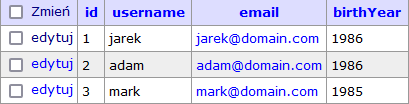

# Database > Retrieving data (get)

The `get` function is used to retrieve data from the database.

Function structure:

`get(string $table, array $parameters = [])`

 It has two main variabled to define the data we want to get:

 - `table` (required) - Selected table name
 - `parameters` (optional) - Parameters in array that narrow the results
     - `select` - Retrieving only selected columns, separated by comma.  Empty will be replaced by `*`
     - `where` - Where sql query
     - `limit` - Limit of retrieved results. Default `1000`
     - `offset` - Offset of retrieved results. Default `0`
     - `order` - Choosing how to sort the results

For example, we will work with simple database table names `users`:



## Examples:

### Get all the data from a table:


```php
$data = $db->get('users');
/* Example return :
Array
(
    [0] => Array
        (
            [id] => 1
            [username] => jarek
            [email] => jarek@domain.com
            [birthYear] => 1986
        )
    [1] => Array
        (
            [id] => 2
            [username] => adam
            [email] => adam@domain.com
            [birthYear] => 1986
        )
    [2] => Array
        (
            [id] => 3
            [username] => mark
            [email] => mark@domain.com
            [birthYear] => 1985
        )
)
*/
```

### Get selected rows:

```php
$data = $db->get('users', [
    'select' => 'username,birthYear',
    'where' => 'birthYear="1986"',
    'limit' => 10,
    'offset' => 0,
    'order' => 'id DESC',
]);
/* Example return :
Array
(
    [0] => Array
        (
            [username] => adam
            [birthYear] => 1986
        )
    [1] => Array
        (
            [username] => jarek
            [birthYear] => 1986
        )
)
*/
```

### Get single row:

```php
$data = $db->get('users', [
    'where' => 'id="1"',
    'limit' => 1,
    'order' => 'id DESC',
]);
/* Example return :
Array
(
    [id] => 1
    [username] => jarek
    [email] => jarek@domain.com
    [birthYear] => 1986
)
*/
```